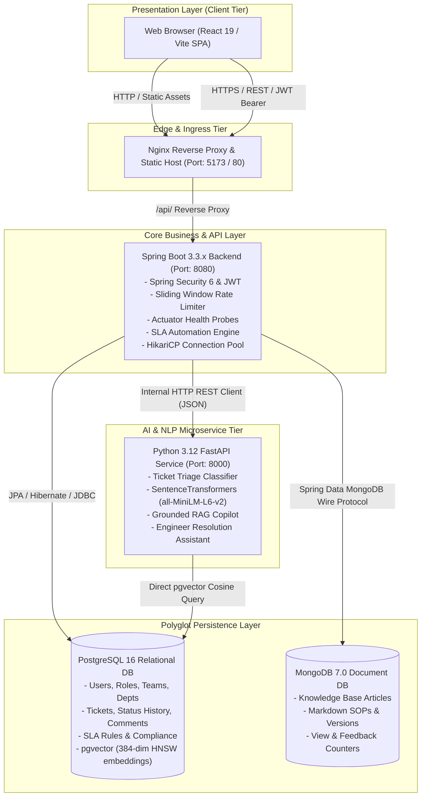
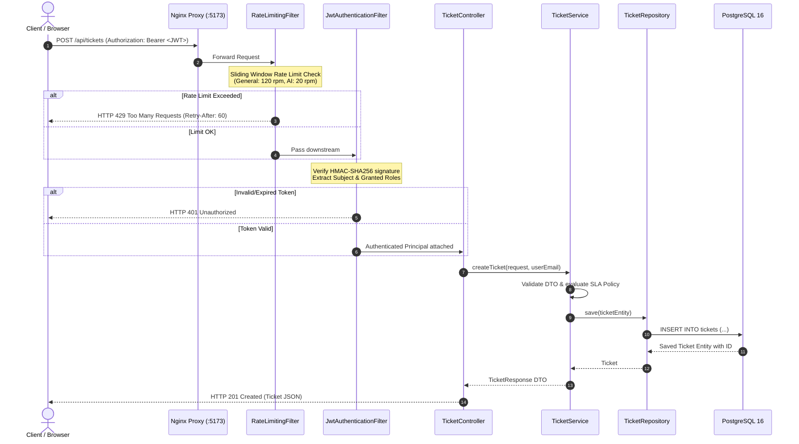
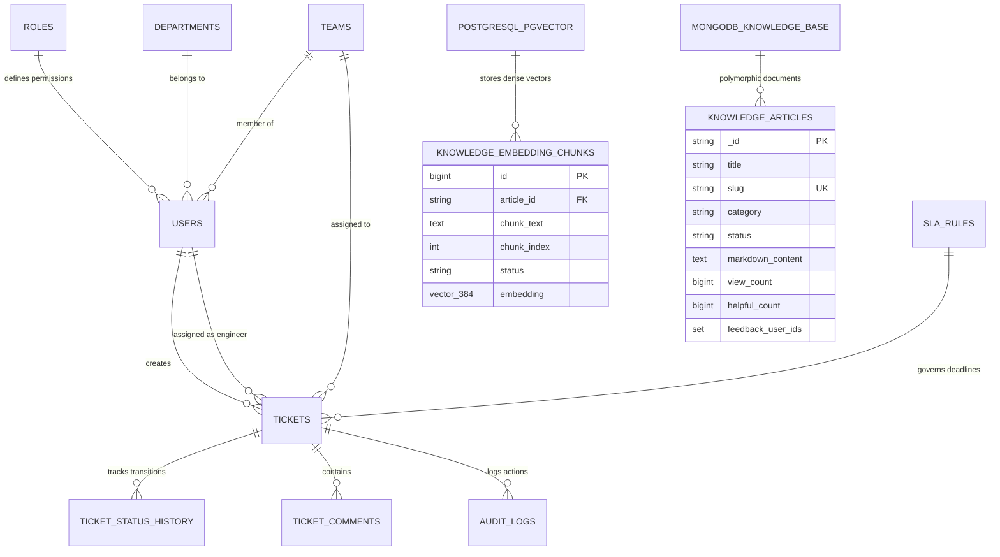
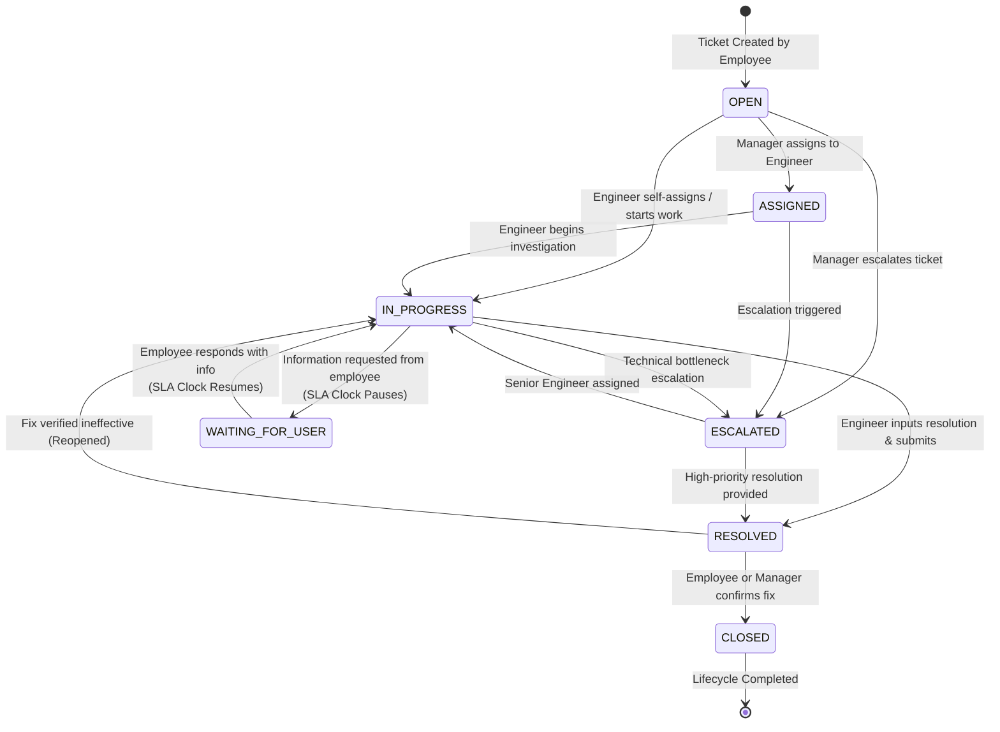
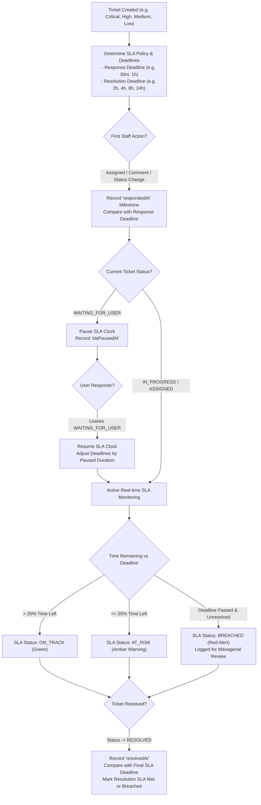
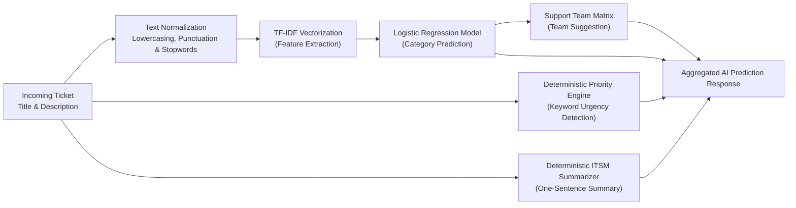
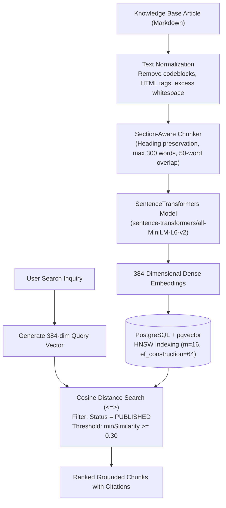
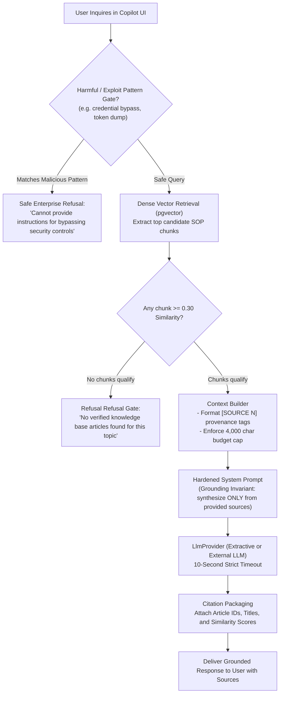
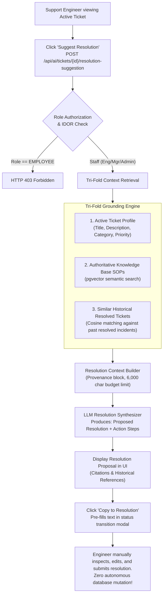
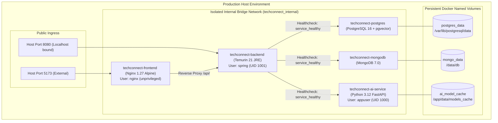

# TechConnect System Architecture & Lifecycle Diagrams

This document contains authoritative technical architecture and lifecycle diagrams for **TechConnect — AI-Powered Enterprise IT Service Management Platform**, rendered using Mermaid.

---

## 1. Overall System Architecture

---

## 2. Frontend to Backend Request Flow

---

## 3. Database Architecture (Polyglot Persistence)

---

## 4. Ticket Lifecycle State Machine

---

## 5. SLA Lifecycle & Governance

---

## 6. AI Ticket Intelligence Microservice (Triage & Classification)

---

## 7. Knowledge Ingestion & Semantic Search Pipeline

---

## 8. RAG Pipeline (AI Support Copilot)

---

## 9. AI Engineer Resolution Assistant Architecture

---

## 10. Multi-Container Docker Deployment Architecture

